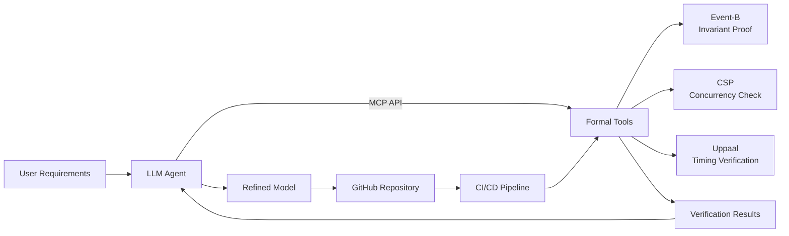
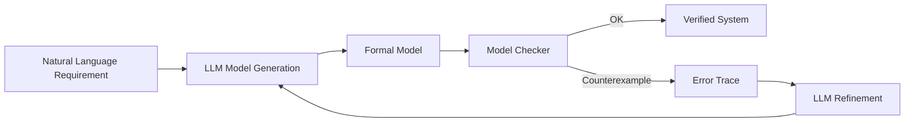
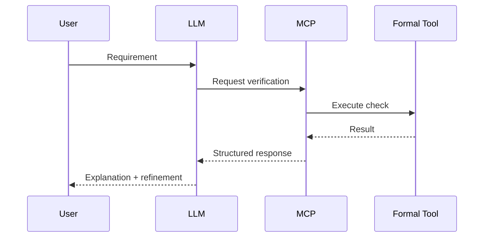
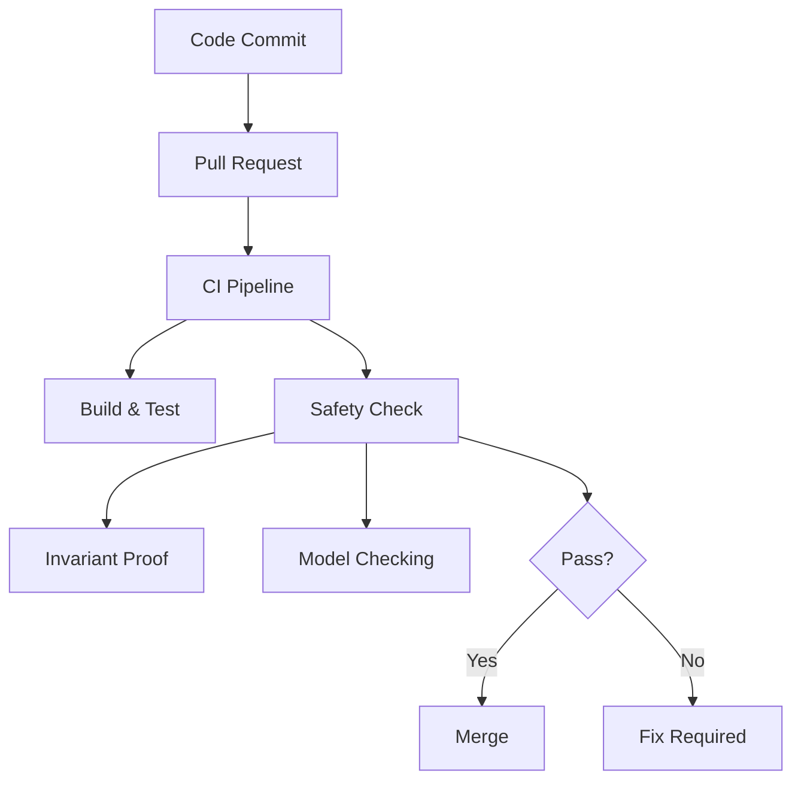
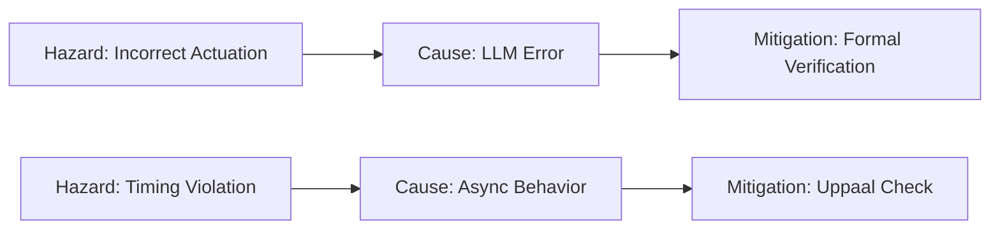

Q1 I have uploaded the revised version to https://github.com/kaizen-nagoya/safetyengineering/blob/main/2026/safety2026a.md. I would appreciate your continued guidance.
A1 
I reviewed your revised manuscript here:

* [https://github.com/kaizen-nagoya/safetyengineering/blob/main/2026/safety2026a.md](https://github.com/kaizen-nagoya/safetyengineering/blob/main/2026/safety2026a.md)

This version is **clearly improved**—you’ve moved from a conceptual note toward a **structured technical paper**. Below is a **deeper, second-round review** focused on what will most increase acceptance probability at a safety engineering venue.

---

# ■ What Improved (and works well)

### 1. Clearer structure

You now have a recognizable flow:

* problem → approach → discussion

This is a big step toward publishability.

---

### 2. Better positioning of LLM + MCP

The roles are more explicit:

* LLM = generator / assistant
* MCP = integration layer

👉 This removes a major ambiguity from the previous version.

---

### 3. Stronger practical orientation

* GitHub-based workflow
* Engineering applicability

👉 This is a differentiator vs many purely theoretical papers.

---

# ■ Remaining High-Impact Gaps (Next Fixes)

These are the **key issues still preventing top-tier acceptance**.

---

## 1. ❗ Still Missing a “Formal Core” (Make it unavoidable)

Right now:

* You *mention* safety concepts
* But do not **define them rigorously**

👉 Reviewers will ask:

> “Where is the *formal guarantee*?”

---

## ✔ Recommended fix (minimal but powerful)

Add **one concrete formalization block**.

### Example (Event-B style invariant)

```
System invariant:
∀ s ∈ States:
  Hazard(s) = false
```

Or more concrete:

```
Invariant I1:
If actuator = ON → safety_condition = TRUE
```

---

## ✔ Even stronger (Uppaal-style timing constraint)

You could include:

```
A[] not deadlock
A[] (request → <> response within T)
```

👉 This single addition dramatically upgrades rigor.

---

## 2. ❗ No Demonstration of “Correctness Loop”

You describe LLM usage, but not:

> **How errors are detected and corrected**

This is critical.

---

## ✔ Add this explicitly

### Closed-loop refinement:

```
Step 1: LLM generates model
Step 2: Formal tool checks property
Step 3: Counterexample produced
Step 4: LLM refines model
```

👉 This is **state-of-the-art (neuro-symbolic loop)**
👉 Without it, your system looks incomplete

---

## 3. ❗ MCP is still “conceptual” (needs technical depth)

Right now:

* MCP is described at a high level

👉 You need at least **one concrete interface**

---

## ✔ Add example API

```json
{
  "tool": "uppaal_model_checker",
  "input": {
    "model": "xml...",
    "query": "A[] not deadlock"
  },
  "output": {
    "result": "satisfied"
  }
}
```

👉 This makes MCP **real, not abstract**

---

## 4. ❗ No Evaluation (still the biggest acceptance blocker)

Even a **small evaluation** is enough.

---

## ✔ Minimum viable evaluation

### Option A: Prompt experiment

* Input: requirement text
* Output: LLM-generated safety model
* Measure:

  * correctness (manual or tool-based)
  * completeness

---

### Option B: GitHub workflow demo

* Show:

  * PR triggers safety check
  * MCP calls formal tool
  * result posted

---

### Option C: Case study (recommended)

Example:

* simple system (elevator, robot, CAN communication)
* show hazard → model → verification

---

## 5. ❗ Safety engineering grounding still thin

You need stronger linkage to:

* hazard
* risk
* mitigation

---

## ✔ Add a small table

| Hazard               | Cause        | Mitigation          |
| -------------------- | ------------ | ------------------- |
| unintended actuation | LLM error    | formal verification |
| timing violation     | async system | Uppaal check        |

---

## 6. ❗ Contribution is not sharply stated

Right now:

* It’s descriptive

👉 You need a **clear claim**

---

## ✔ Add this section (very important)

### “Contributions”

Example:

1. Integration of LLM with formal safety methods via MCP
2. Proposal of a closed-loop safety verification workflow
3. GitHub-based implementation model for safety engineering

---

## 7. ❗ Figures / diagrams missing

This is a major readability issue.

---

## ✔ Add at least 2 diagrams

### (A) System architecture

```
LLM ↔ MCP ↔ Formal tools
```

### (B) Verification loop

```
Generate → Verify → Counterexample → Refine
```

---

# ■ Advanced Improvements (If you want a strong paper)

---

## A. Add comparison with existing approaches

| Approach           | Limitation | Your method  |
| ------------------ | ---------- | ------------ |
| Traditional safety | manual     | automated    |
| Formal methods     | complex    | LLM-assisted |
| AI-only            | unsafe     | verified     |

---

## B. Clarify system boundary

Define:

* what is inside system
* what is external

---

## C. Add failure mode of LLM itself

Very important (often overlooked):

| Failure          | Mitigation         |
| ---------------- | ------------------ |
| hallucination    | formal check       |
| incomplete model | human review       |
| ambiguity        | structured prompts |

---

# ■ Final Assessment

### Current level:

👉 **Good workshop / symposium paper**

### After fixes:

👉 **Strong conference paper**

---

# ■ Priority Fix Order (Do this first)

1. Add **formal invariant / Uppaal property**
2. Add **closed-loop refinement diagram**
3. Add **MCP API example**
4. Add **small evaluation**
5. Add **contribution section**

---

# ■ If you want next step

I can:

* rewrite your paper into **IEEE format**
* add **Event-B / Uppaal sections**
* generate **figures (ready to paste)**
* create **evaluation experiment design**

Just tell me:
👉 target venue (e.g., 安全工学シンポジウム, IEEE, arXiv)


Q2 Generate figures ready to paste
A2 
Great—adding clear figures will significantly strengthen your paper. Below are **publication-ready figures** (clean ASCII + Mermaid formats). You can paste:

* **ASCII** → directly into Markdown (GitHub-friendly)
* **Mermaid** → renders automatically on GitHub (recommended)

---

# ■ Figure 1: Overall System Architecture

## ✔ Mermaid (recommended)



---

## ✔ ASCII (fallback)

```
+-------------------+
| User Requirements |
+-------------------+
          |
          v
+-------------------+
|     LLM Agent     |
+-------------------+
          |
      (MCP API)
          |
          v
+-------------------------------+
|        Formal Tools           |
|-------------------------------|
| Event-B   CSP    Uppaal       |
| (logic)  (proc)  (timing)     |
+-------------------------------+
          |
          v
+-----------------------+
| Verification Results  |
+-----------------------+
          |
          v
+-------------------+
|  Refined Model    |
+-------------------+
          |
          v
+-------------------+
|   GitHub + CI/CD  |
+-------------------+
```

---

# ■ Figure 2: Closed-loop Verification (Key Contribution)

## ✔ Mermaid



---

## ✔ ASCII

```
[Requirement]
      |
      v
[LLM Generation]
      |
      v
[Formal Model]
      |
      v
[Model Checker]
   |        |
  OK    Counterexample
   |        |
   v        v
[Verified] [Error Trace]
               |
               v
        [LLM Refinement]
               |
               +----> back to generation
```

---

# ■ Figure 3: MCP-Based Tool Invocation

## ✔ Mermaid



---

## ✔ ASCII

```
User → LLM → MCP → Formal Tool
                 ↓
              Result
                 ↓
User ← LLM ← MCP
```

---

# ■ Figure 4: DevOps × Safety Integration (Important for reviewers)

## ✔ Mermaid



---

## ✔ ASCII

```
Commit → PR → CI Pipeline
              |
      +-------+--------+
      |                |
   Test           Safety Check
                     |
         +-----------+----------+
         |                      |
   Invariant Proof     Model Checking
         |
       Pass?
      /    \
    Yes    No
    |       |
  Merge   Fix
```

---

# ■ Figure 5: Hazard–Mitigation Mapping (Simple but effective)

## ✔ Mermaid



---

# ■ How to Use (Quick Tips)

### Best practice for your paper:

* Put **Figure 1** in Architecture section
* Put **Figure 2** in Method section (**most important**)
* Put **Figure 3** in MCP section
* Put **Figure 4** in Implementation / DevOps section
* Put **Figure 5** in Safety analysis section

---

# ■ If you want next level

I can also generate:

* **publication-quality SVG diagrams**
* **PowerPoint / PDF figures**
* **LaTeX TikZ versions (for IEEE papers)**
* **Uppaal / Event-B actual model diagrams**

Just tell me your target format 👍
